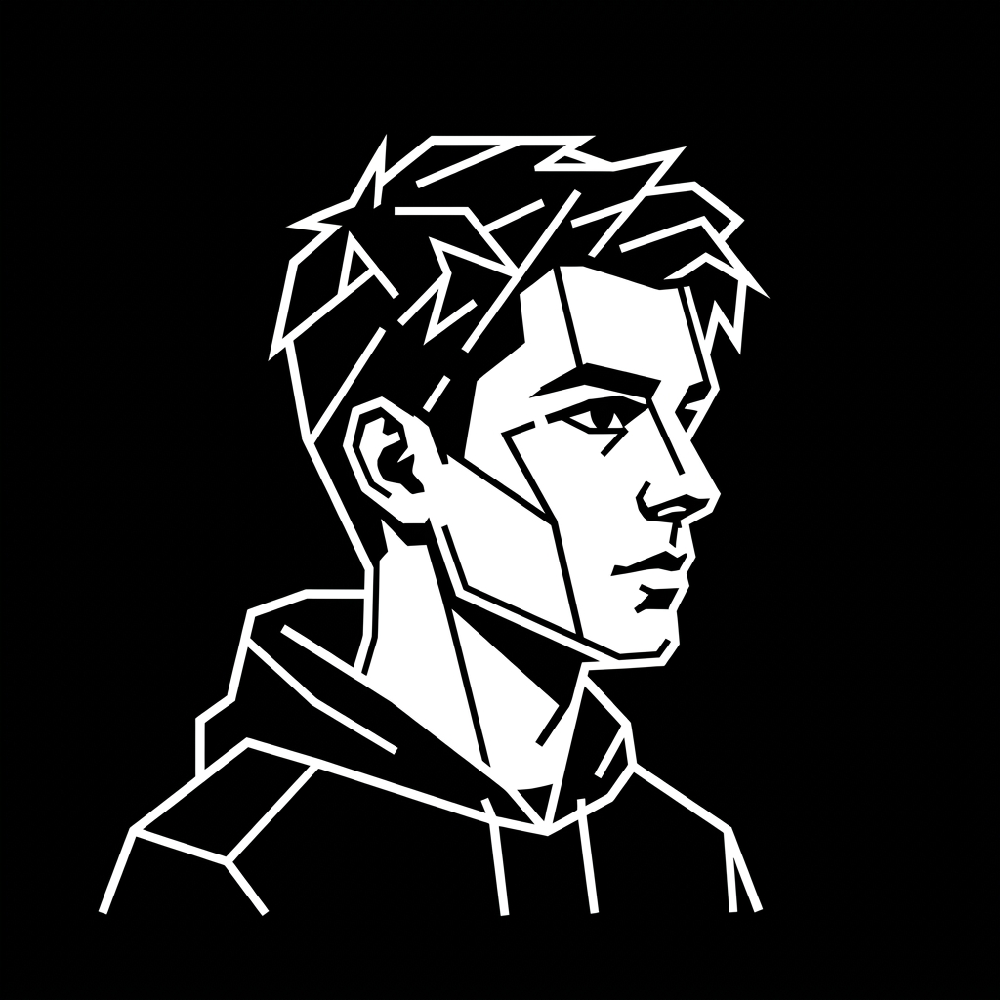

<div align="center">
  
  <h1>Raizz Portfolio</h1>
  <p>A minimalist, high-performance, and dark-themed developer portfolio & blog.</p>

  <!-- Badges -->
  <p>
    
    
    
    
    
  </p>
</div>

<br />

## ✨ Features

- **Dark Mode First:** Premium dark aesthetic inspired by modern terminal environments, featuring subtle glassmorphism and micro-animations.
- **Zero Frameworks:** Built entirely with Vanilla HTML, CSS, and JS for maximum speed, lightweight performance, and absolute control.
- **Custom Blog Engine:** Includes a bespoke Python CLI tool (`add-post.py`) that acts as a local static site generator for your blog posts.
- **Fully Responsive:** Perfectly scaled and readable on mobile, tablet, and desktop environments.
- **Deploy Ready:** Pre-configured with `netlify.toml` for instant, optimized deployment via Netlify.

## 🛠️ Tech Stack

- **Frontend:** Vanilla HTML5, CSS3, JavaScript (ES6+).
- **Typography:** *Space Grotesk* for headings & *Space Mono* for code and metadata.
- **Automation / Blog:** Python 3 (CLI script for post generation).
- **Hosting:** Netlify (Ready) / Vercel / GitHub Pages.

## 🚀 Getting Started

Running this project locally requires zero complex build steps or dependencies. Just a simple local server.

```bash
# 1. Clone the repository
git clone https://github.com/Hekimovraiz/raizz-portfolio.git

# 2. Navigate into the directory
cd raizz-portfolio

# 3. Start a local server (Python 3 required)
python3 -m http.server 3000
```
Then open `http://localhost:3000` in your web browser.

## 📝 Writing a Blog Post

This portfolio features a minimal, custom blog system powered by a Python script, removing the need for a heavy CMS.

To create a new post:
1. Run the script in the root directory:
   ```bash
   python3 add-post.py
   ```
2. Follow the CLI prompts to enter the **Title** and **Excerpt** of your post.
3. The script automatically generates a clean HTML file in `blog/posts/` and updates the JSON index (`blog/posts.json`).
4. Open the newly generated HTML file and write your content inside the `<div class="post-content">` tag!

## 🌐 Deployment (Netlify)

This project is tailored for instant deployment on **Netlify**, utilizing the included `netlify.toml` file for optimal caching and routing configuration. You mentioned you know Git/Vercel/Netlify, so this will be a breeze!

1. Push this repository to your GitHub account (`git push`).
2. Log in to [Netlify](https://www.netlify.com/) and click **"Add new site" -> "Import an existing project"**.
3. Connect your GitHub account and select this repository.
4. Leave the build command empty (it's a static site) and click **Deploy**.
5. Every time you push a new blog post to GitHub, Netlify will automatically update your live site!

## 👤 Author

**Raiz Hekimov**
- **GitHub:** [@Hekimovraiz](https://github.com/Hekimovraiz)
- **Codeforces:** [0xRaiz](https://codeforces.com/profile/0xRaiz)
- **Contact:** raizhekimov2010@gmail.com
